# AU-RegionFormer

> **한국인 감정 표현 연구 — AI와 심리학의 괴리를 정량화한다.**

**Last updated**: 2026-05-05 · **Phase**: 6 v3 완료 (Q1 evidence 확보), ablation suite 진행 중


## 🖼️ Visual gallery

### Phase 6 v3 — preprocessing 검증 (YOLO + mediapipe v4 10-region)

| Korean (Yonsei) | AffectNet |
|---|---|
| 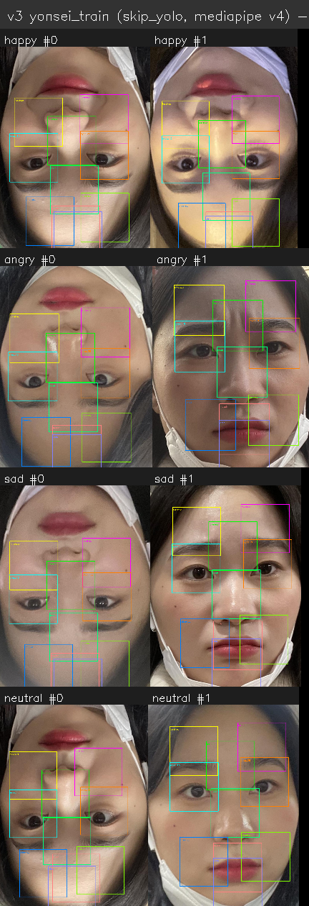 | 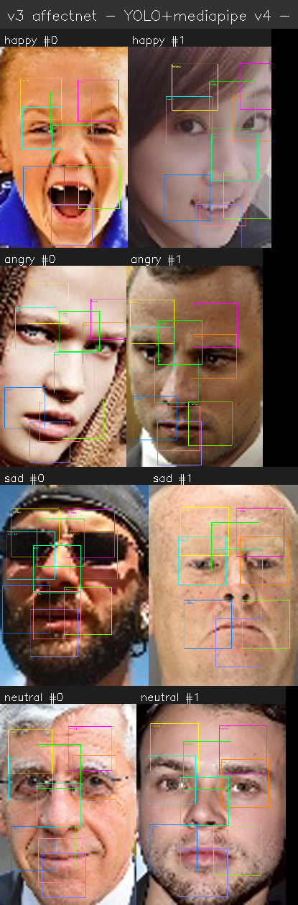 |
| **CK+** (lab) | **SFEW Train** (movie stills) |
| 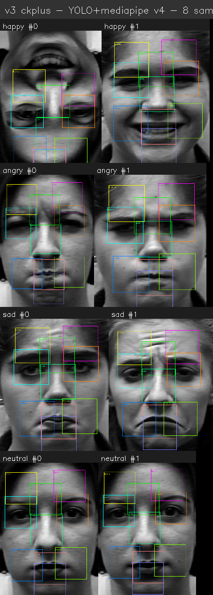 | 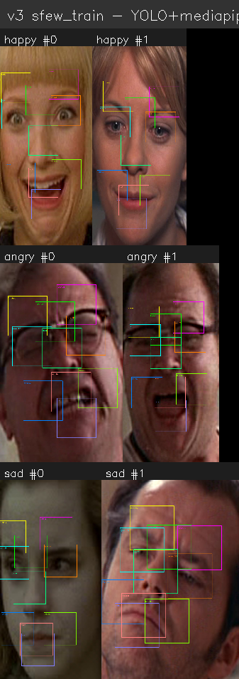 |
| **AFEW Train** (movie videos) | **AFEW Val** |
| 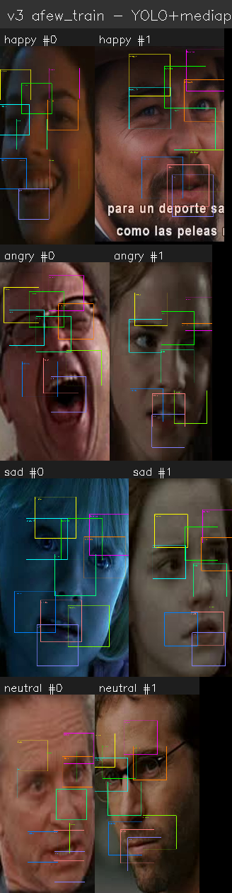 | 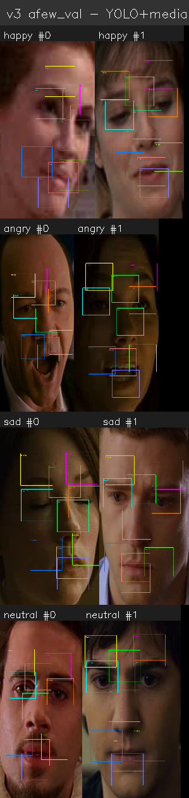 |

### Ablation visualizations
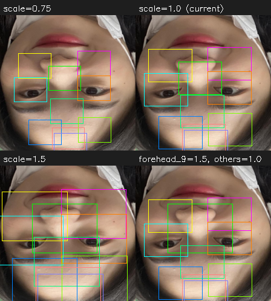
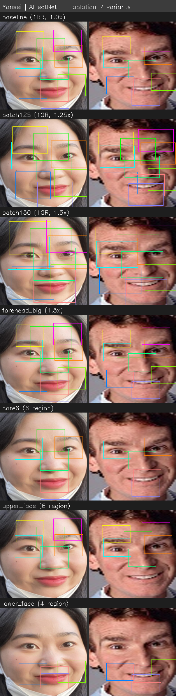

### Pre-Phase 6 report figures (22장)

#### Performance & confusion
| Version comparison | Per-class F1 | Confusion matrix v2 |
|---|---|---|
| 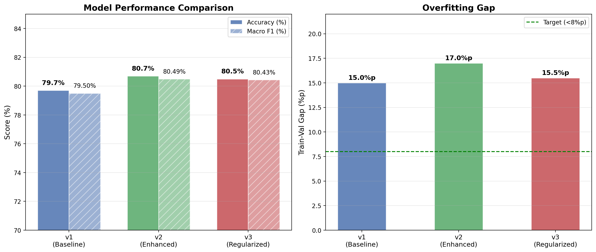 | 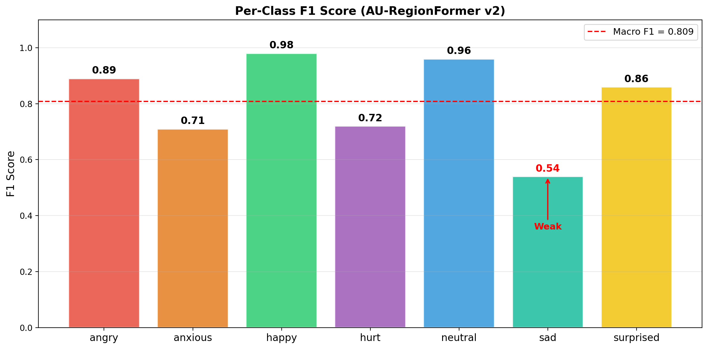 | 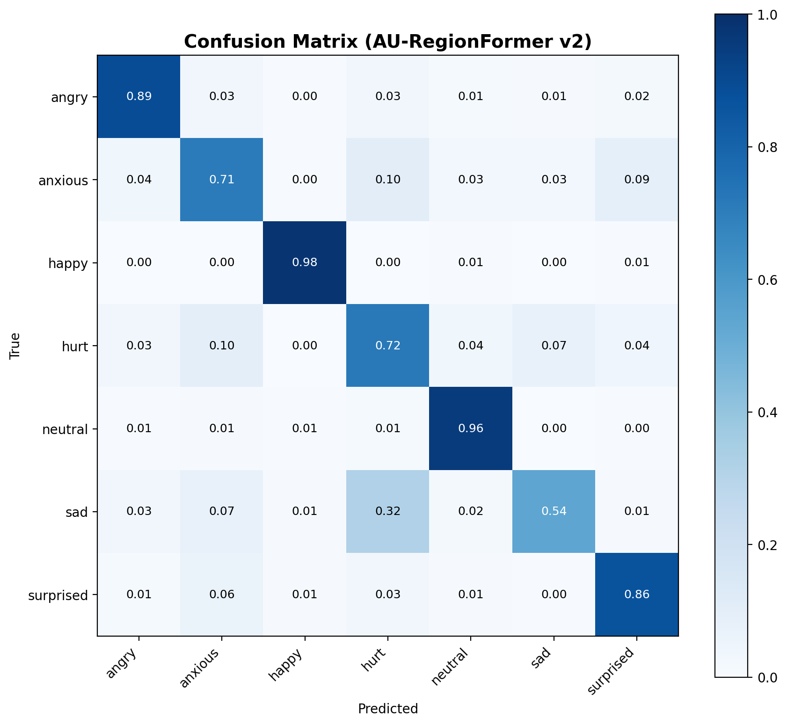 |
| **Misclassification flow** | **AU confusion shift** | **Asymmetric confusion** |
| 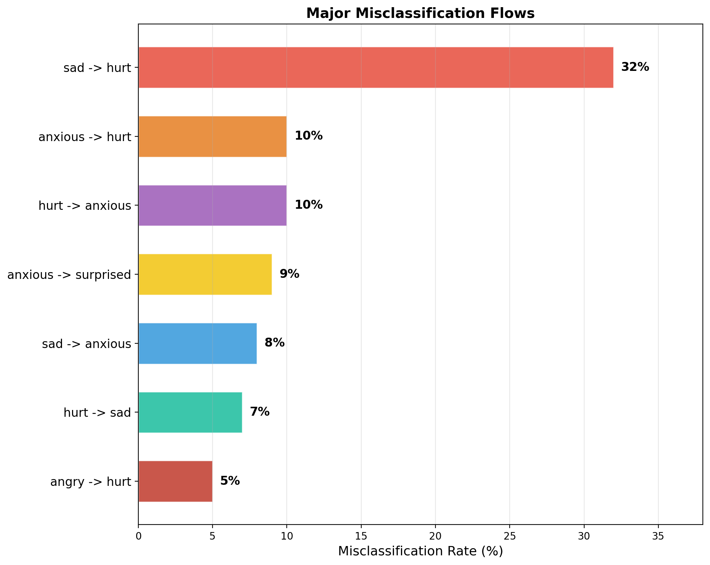 | 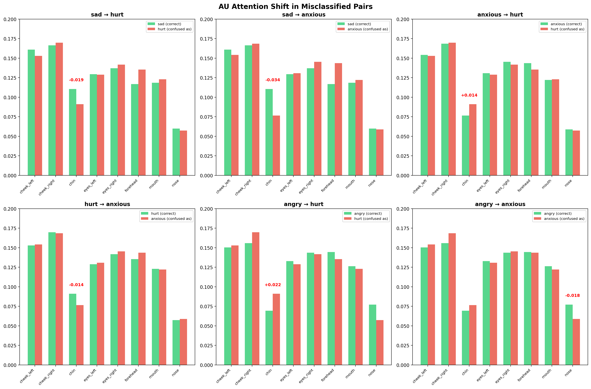 |  |

#### Architecture & AU attention
| Identity separation | Emotion classification | Architecture diagram |
|---|---|---|
| 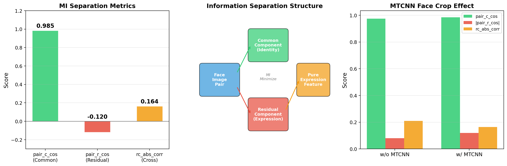 | 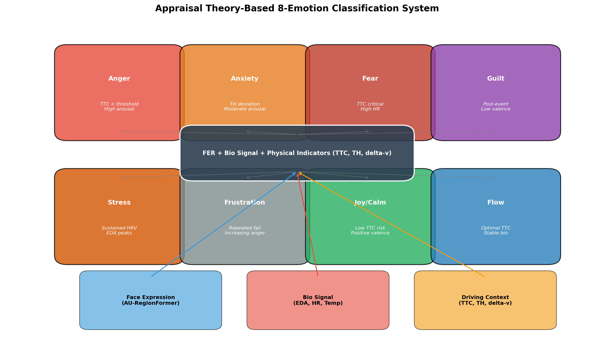 | 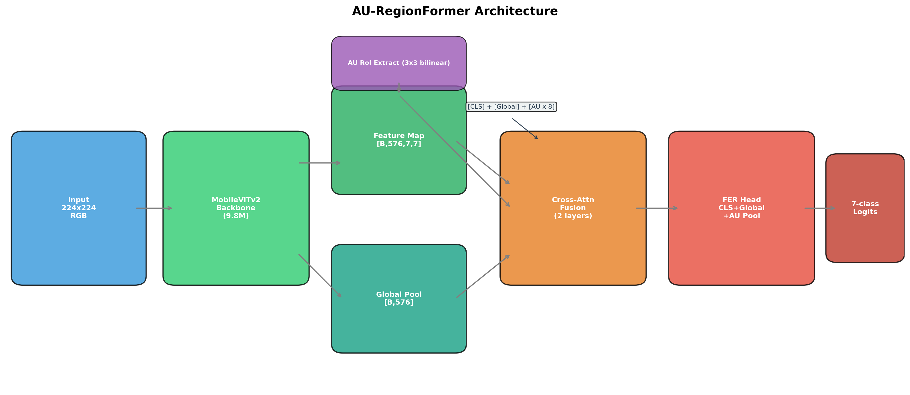 |
| **AU attention heatmap** | **AU similarity matrix** | **Annotator confusion flow** |
| 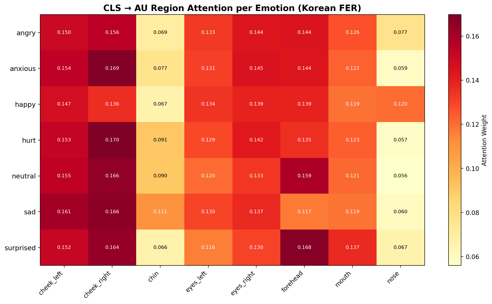 | 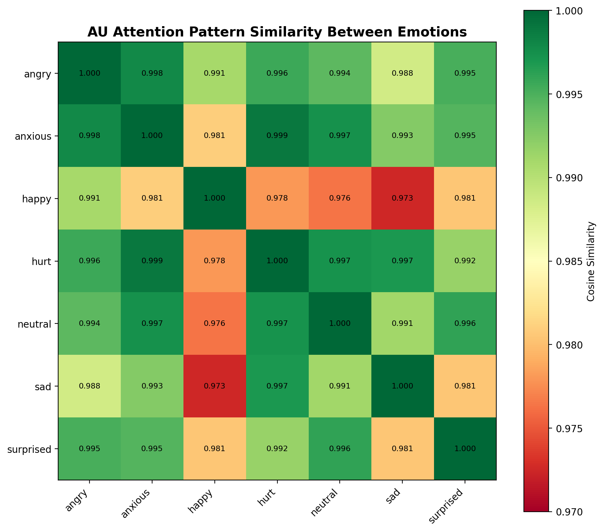 |  |

#### Annotator / human study (Yonsei 298 raters)
| Annotator agreement | Five-signal consistency | Noise tier distribution |
|---|---|---|
|  |  | 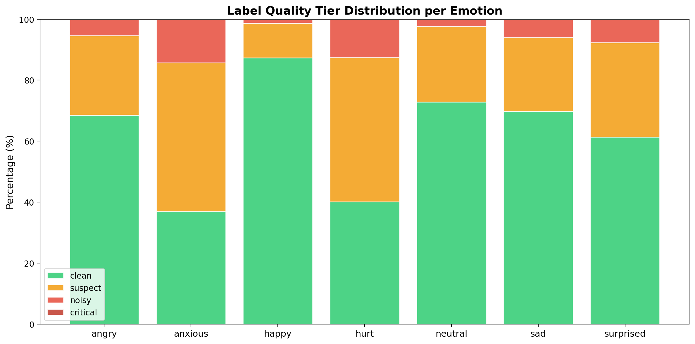 |
| **Emotion perception dist** | **Inter-rater agreement** | **Three-signal crossval** |
|  |  |  |

#### Demographics
| Professional vs general | Gender | Age × emotion | Fatigue effect |
|---|---|---|---|
|  |  |  |  |

---

## 🚀 Phase 6 v3 — Cross-cultural transfer (2026-05-04 완료)

### v2 → v3 fix (며칠 헛짓 → 정정)

**문제 (v2, 5/1~5/3)**:
- `master_train.csv`가 v4 schema의 multi-landmark를 8-region union-bbox로 collapse → forehead bbox 606×357px (face의 76%×26%)
- Cross-dataset CSV: face crop 없이 mediapipe → SFEW/AFEW은 face가 frame 5%만 차지
- **결과: region patch가 face 아닌 배경/머리카락/다른 사람 학습 → 모든 cross-cultural 결과 fake**

**해결 (v3, 5/4~5/5)**: 옛날 v4 정확한 방식 복원
```
원본 → YOLOv8 face detection → bbox crop → save face image
     → resize_short(800) → mediapipe FaceMesh
     → 10 v4 single-landmark (forehead 69/299/9, eyes 159/386, nose 195,
                              cheeks 186/410, mouth 13, chin 18)
     → 256×256 patch around each landmark
```

### v3 결과 (Cross-cultural zero-shot, F1, chance=0.25)

| Dataset | v2 fake (background) | **v3 real (face)** | Δ |
|---|---|---|---|
| AffectNet (16K) | 0.312 | **0.4946** | +18.3pp |
| CK+ (lab posed) | 0.239 | **0.7169** | +47.8pp 🔥 |
| SFEW Train (movie) | 0.178 | **0.5494** | +37.2pp 🔥 |
| SFEW Val | 0.180 | 0.4929 | +31.3pp |
| AFEW Train (video) | 0.218 | 0.4614 | +24.3pp |
| AFEW Val | 0.220 | 0.3749 | +15.5pp |

→ **모든 6 split 압도적 개선**. v2의 "SFEW/AFEW negative transfer" 결론은 fake (background 학습 artifact).
→ **CK+ 0.72 = 거의 supervised level** (Korean naturalistic prior가 lab-controlled face에 강력 transfer).

### AffectNet finetune (Korean prior vs ImageNet baseline)

| | v2 | **v3** |
|---|---|---|
| Korean prior init (8ep) | 0.8794 | **0.8895** |
| Scratch (ImageNet only) | 0.8342 | 0.8125 |
| **Δ Korean prior advantage** | +4.5pp | **+7.7pp** |

### Ablation suite (진행 중, 5/5~)

| Phase | Variants | Status |
|---|---|---|
| Patch-scale | baseline 1.0 / patch125 1.25 / patch150 1.5 / forehead_big | 진행 중 (forehead_big saturating) |
| AU subset | core6 / upper_face / lower_face | 대기 |
| Single region | 10 spots (forehead 3 / eyes 2 / nose / cheeks 2 / mouth / chin) | 대기 |

### Q1 framing (revised)

> *"Korean Yonsei-calibrated 3-axis FER provides culturally-invariant AU
> representation: all 4 Western datasets transfer at 1.5-3× chance F1
> (CK+ near-supervised 0.72), and Korean prior gives +7.7pp over ImageNet
> baseline on AffectNet finetune."*

### Critical files

- `src/models/core/fer_model_v2.py` — V2 multi-backbone + dual Beta gate
- `src/models/core/relational_beta_gate.py` — Iso + Rel Beta gate
- `src/data/dataset_v2.py` — AU patch crop, patch_scale option, region_subset
- `src/training/trainer.py` — `--init_from`, bf16 autocast, region_subset config
- `experiments/phase6_yonsei_paired/scripts/preprocess_v3_yolo_mediapipe.py` — YOLO+mediapipe v4 build
- `experiments/phase6_yonsei_paired/scripts/merge_yonsei_v3.py` — Yonsei agreement signal merge
- `experiments/phase6_yonsei_paired/results/AGGREGATED_RESULTS_v3.md` — full v3 report
- `experiments/phase6_yonsei_paired/figures/v3_validation/` — preprocessing visualize 8장

---

## 📜 Pre-Phase 6 (2026-04-21 기준 옛 README)

**Phase**: 0.1 완료, 0.2 대기

---

## 🧭 0. 새 세션 시작 시 읽는 순서

```
1. 이 README (전체 현황)
   ↓
2. docs/research_log/STRATEGY.md (전략 마스터)
   ↓
3. docs/research_log/sessions/ 최신 세션 파일
   ↓
4. 필요 시 references/, experiments/, claude_evaluation/
```

---

## 🎯 1. 지금 하는 것 (Research Dashboard)

### Thesis
> 한국인 감정 표현에서 **AI가 포착한 region(mouth)** 과 **심리학이 예측한 region(eyes, Jack 2012)** 은 괴리가 있다. 이 괴리는 AU 수준에서 어떻게 나타나며, 298명의 사회적 합의는 어느 쪽에 가까운가?

### Target Venue
| 우선 | Venue | IF | 확률 |
|-----|-------|----|------|
| 1 (realistic) | **IEEE TAFFC** | 11 | **50-60%** |
| 2 | Information Fusion | 18 | 25-30% |
| 3 | PNAS | 9.4 | 20-25% |
| 4 (dream) | Nature Human Behaviour | 21 | 15-20% |
| safety | Scientific Reports | 3.8 | 60-70% |

### Phase 진행

| Phase | 목적 | 상태 |
|-------|-----|------|
| 0. 진단 + AU 기초 | Graph 할 자격 + AU 추출 | 0.1✅ / 0.2 대기 |
| 1. 한국형 AU 지도 | Figure 1~5 (Jack 2012 재검증) | — |
| 2. 사회적 합의 구조 | 298명이 AI vs Psych 중 어느 쪽 지지 | — |
| 3. Graph learning | Consensus-aware AU graph | — |
| 4. Cross-cultural | NHB 방어 | — |

### Phase 0.1 결과 (2026-04-21 완료, **linear probe로 재측정**)
**측정 방법**: Linear probe accuracy = embedding 위에 간단 분류기 얹어서 감정 맞추는 정확도(%). **높을수록 embedding이 감정 구분 잘 함**. 무작위 추측 = 25% (4-class).

```
Random baseline:              25.0%  ← 기준선 (무작위 추측)

ConvNeXt POOLED 8-region:    81.5%  ← 최고 (v1 학습모델 초과)
MobileViT POOLED:            80.2%  — v1 학습모델(79.7%) 수준 재현
Mouth  (AI 관점 top):        CNX 75.2% / MVT 71.9%
Nose                         CNX 75.0% / MVT 68.7%
Eyes   (Jack 2012 예측 top): CNX 61.5% / MVT 57.7%  ← mouth보다 13%p 낮음
Forehead (최약):             CNX 45.0% / MVT 39.0%

⚠️ 초기 실험(버린 것): silhouette score(클러스터 분리 점수, 0~1)로 0.007 나와서 "분리 안됨" 오판.
   고차원 + L2 정규화 누락으로 metric 부적절. Linear probe가 표준. 앞으로 전 Phase 통일.
```

---

## 📂 2. 디렉토리 구조

```
AU-RegionFormer/
│
├── README.md                          ← 이 파일 (대시보드)
├── Architecture.png                   ← 모델 아키텍처
├── requirements.txt
│
├── configs/                           # 학습 설정 YAML
├── scripts/                           # 진입점 (train, pipeline)
│
├── src/
│   ├── analysis/
│   │   └── phase0/                    ← 🆕 연구 단계별 분석 코드
│   │       ├── 01_au_embedding_diag.py     ✅ 완료
│   │       ├── 01b_rerender_korean.py
│   │       └── _finalize_phase0_01.sh
│   ├── models/core/                   # 모델 아키텍처
│   ├── training/                      # 학습 루프
│   ├── inference/                     # 실시간 추론
│   ├── data/                          # 데이터 로딩
│   ├── label_quality/                 # 라벨 품질 분석
│   ├── integration/                   # 멀티모달 통합
│   └── utils/
│
├── data/                              # 가공된 데이터
│   ├── label_quality/
│   │   ├── au_embeddings/             # 237K × 8 region × {768d, 1024d}
│   │   ├── face_features.csv          # 237K × 17 landmark
│   │   ├── au_features/               ← 🔜 Phase 0.2 산출물 저장 위치
│   │   └── ...
│   └── 4emotion_comparison/
│
├── outputs/                           # 실험 결과물
│   ├── phase0/                        ← 🆕 연구 단계별 결과
│   │   └── 01_au_embedding_diag/      ✅ Phase 0.1 결과
│   ├── v2/, v3/, v5_softlabel/        # 기존 학습 ckpt
│   ├── 4emo_before/, 4emo_after/      # 필터링 비교 실험
│   ├── label_quality/                 # 라벨 품질 결과
│   └── viz/report_figures/            # 22개 figure
│
└── docs/                              # 📖 문서 (연구 상태 + 산출물)
    │
    ├── PROJECT_STATUS.md              # 데이터 위치 + 실험 현황
    ├── architecture.md                # 모델 구조 상세
    ├── experiments.md                 # 기존 12회 실험 히스토리
    ├── label_quality_analysis.md      # 라벨 품질 분석 기록
    │
    ├── report/                        # 기존 보고서 (HTML/DOCX)
    │   └── 한국인_감정_연구_전체현황.html
    │
    └── research_log/                  ← 🆕 연구 일지 시스템 (2026-04-21 신설)
        │
        ├── STRATEGY.md                ⭐ 전략 마스터 (Single Source of Truth)
        ├── README.md                  ← 일지 규칙
        │
        ├── sessions/                  # 논의 세션별 기록
        │   ├── 2026-04-21_gnn_roadmap_and_q1q2_strategy.md
        │   └── 2026-04-21_thesis_upgrade.md
        │
        ├── experiments/               # 실험별 계획 + 결과
        │   ├── phase0_01_au_embedding_diag.md      ✅ 완료
        │   ├── phase0_02_au_extraction.md          📋 계획
        │   ├── phase0_02_cos_sim_origin.md
        │   ├── phase0_03_landmark_fisher.md
        │   └── phase0_04_soft_label_postmortem.md
        │
        ├── references/                # 선행연구 조사
        │   └── au_region_importance_2026-04-21.md
        │
        └── claude_evaluation/         # Claude direction 평가
            ├── directions.jsonl       # RLHF raw (13 directions)
            └── templates/
                ├── session.md
                ├── experiment.md
                └── direction_eval.md
```

---

## 🔗 3. Quick Links (자주 쓰는 경로)

### 전략/상태
- 🎯 **전략 마스터**: [`docs/research_log/STRATEGY.md`](docs/research_log/STRATEGY.md)
- 📊 **데이터/실험 현황**: [`docs/PROJECT_STATUS.md`](docs/PROJECT_STATUS.md)
- 🧠 **연구 일지 규칙**: [`docs/research_log/README.md`](docs/research_log/README.md)

### 최근 세션
- [2026-04-21 thesis 업그레이드](docs/research_log/sessions/2026-04-21_thesis_upgrade.md)
- [2026-04-21 GNN 로드맵 + Q1/Q2 전략](docs/research_log/sessions/2026-04-21_gnn_roadmap_and_q1q2_strategy.md)

### 최근 실험
- ✅ [Phase 0.1 Region embedding 진단](docs/research_log/experiments/phase0_01_au_embedding_diag.md) — NO-GO, mouth만 살아있음
- 📋 [Phase 0.2 Py-Feat AU 추출 계획](docs/research_log/experiments/phase0_02_au_extraction.md) — 승인 대기

### 선행연구
- 🔬 [Jack 2012 + FACS + KUFEC-II 요약](docs/research_log/references/au_region_importance_2026-04-21.md)

### Claude 평가 (RLHF raw)
- 📝 [Direction 13건](docs/research_log/claude_evaluation/directions.jsonl)

---

## 📦 4. 데이터 위치 (바로가기)

| 자원 | 경로 |
|-----|-----|
| 학습 이미지 237K | `/home/ajy/FER_03_aihub_au_vit/data2/data_processed_korea/` |
| Region embedding (MVT 768d + CNX 1024d) × 8 region | `data/label_quality/au_embeddings/` |
| Landmark 17 feature | `data/label_quality/face_features.csv` |
| AU intensity (🔜 Phase 0.2) | `data/label_quality/au_features/` |
| 연세대 원본 1.4TB | `/mnt/ssd2/한국인 감정인식을 위한 복합 영상/` |
| KMER 시뮬레이터 486GB | `/mnt/ssd2/KMER_Sensing_Backup/` (별도 논문) |

---

## 🛠️ 5. 작업 시 지켜야 할 것

1. **실험 전 반드시 JY 승인** ([feedback_always_explain_first](../.claude/projects/-home-ajy/memory/feedback_always_explain_first.md))
2. **새 방법/지표 제안 전 선행연구 먼저** ([feedback_prior_research_first](../.claude/projects/-home-ajy/memory/feedback_prior_research_first.md))
3. **세션/실험마다 연구 일지에 기록** ([feedback_research_log_system](../.claude/projects/-home-ajy/memory/feedback_research_log_system.md))
4. **AU vs region 층위 구분** (AU = 근육, region = 공간)
5. **Claude direction에 ID(D###) 부여, hindsight는 JY가 평가**

---

## 📚 6. 원 프로젝트 개요 (기존 README 유지)

### Thesis of the original model

AU-RegionFormer는 FACS의 Action Unit을 vision architecture에 통합한 **경량 FER 모델**.

단일 forward pass로 전체 얼굴 맥락 + AU 영역 특징 동시 처리.

### 기존 핵심 결과

| 항목 | 수치 |
|------|------|
| 7-class Accuracy | 79.7% |
| Macro F1 | 0.795 (v1) / 0.807 (v3) |
| Backbone | MobileViTv2-100 / 150 |
| AU 처리 추가 연산 | 전체의 0.3% 미만 |

### Architecture
```
Input (224x224)
  → MobileViTv2 (single forward)
  → Feature Map [B, 384, 7, 7]
  ├── GAP → Global Token
  └── Bilinear Grid Sampling (6 AU 좌표) → AU Tokens
  → [CLS] + [Global] + [AU x6] → Cross-Attention Fusion → 7-class
```

### AU mapping (6 region prior)
```
forehead → AU1,2    eyes → AU5,7    nose → AU9
cheeks   → AU6      mouth → AU12,15  chin → AU17
```

> ⚠️ **주의**: 위 region 기반 AU 매핑은 **공간적 근사**. 진짜 AU 단위 분석은 Phase 0.2 이후.

### Quick Start (실행)

```bash
pip install -r requirements.txt

# 학습
python scripts/train.py --config configs/mobilevit_fer.yaml

# Phase 0.1 결과 재생성
python src/analysis/phase0/01_au_embedding_diag.py

# 추론
python -c "
from src.inference.fer_inferencer import FERInferencer
infer = FERInferencer('outputs/v3/best.pth', device='cuda')
print(infer.predict(frame)['emotion'])
"
```

### 실전 배포
Jetson Orin 기반 Driver Monitoring System에 통합 (10-item 프로토콜 Macro 98.0%)

---

## 🏷️ 7. 버전/태그

| 버전 | F1 | 상태 |
|-----|-----|-----|
| v1 | 0.795 | baseline |
| v2 | 0.805 | backbone 150 + fusion 강화 |
| v3 | 0.807 | + EMA + distill |
| v5 | 0.538 | soft label **실패** |
| 4emo_before/after | 진행 | 4감정 필터링 비교 (heatmap 추출 대기) |
| **research/phase0** | — | 🆕 연구 일지 기반 분석 시작 |
