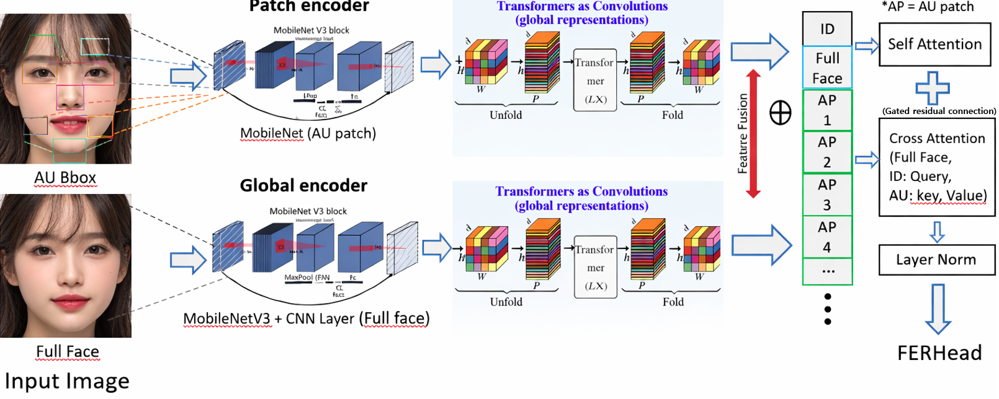

# AU-RegionFormer: Action Unit Region-Focused Transformer for Real-Time Facial Emotion Recognition

> **Single-backbone, AU-guided attention framework** achieving **321x computational reduction** over traditional multi-patch approaches while enabling real-time inference on edge devices (NVIDIA Jetson).

---

## Project Overview

Traditional facial emotion recognition (FER) methods either:
- Process the entire face globally (losing fine-grained AU information), or
- Extract separate patches per AU region (6x backbone forward = 6x slower)

**AU-RegionFormer** solves this with a single-backbone architecture:

```
1 image → 1 backbone forward → feature-level AU extraction → cross-attention fusion → emotion prediction
```

### Key Innovations

| Innovation | Description | Impact |
|-----------|-------------|--------|
| **Feature-Level AU Extraction** | Sample AU features from backbone feature map via bilinear interpolation | 321x speedup vs multi-patch |
| **Cross-Attention Fusion** | CLS/Global tokens query AU tokens with gated residual | Selective region focus |
| **Expression Magnitude Scoring** | L2 distance from neutral centroid for peak frame selection | Fast video inference |
| **Two-Phase Training** | Freeze backbone → unfreeze with 10x lower LR | Stable convergence |
| **Multimodal Ready** | FER + Drowsiness + Arousal/Valence integration pipeline | End-to-end system |

---

## System Architecture



<details>
<summary>Architecture Text Diagram (click to expand)</summary>

```
                    ┌─────────────────────────────────────────────┐
                    │              AU-RegionFormer                │
                    │                                             │
  Input Image ─────►│  MobileViTv2 Backbone (single forward)     │
  (224x224)         │       │                    │                │
                    │       ▼                    ▼                │
                    │  Feature Map          Global Feature        │
                    │  [B,384,7,7]          [B,384]               │
                    │       │                    │                │
                    │       ▼                    │                │
                    │  AU RoI Extract            │                │
                    │  (6 regions)               │                │
                    │  [B,6,384]                 │                │
                    │       │                    │                │
                    │       ▼                    ▼                │
                    │  Token Assembly: [CLS] + [Global] + [AU x6] │
                    │                [B, 8, 384]                  │
                    │                    │                        │
                    │                    ▼                        │
                    │          CrossAttentionFusion               │
                    │          (Gated Residual)                   │
                    │                    │                        │
                    │                    ▼                        │
                    │              FER Head (7-class)             │
                    │              [B, 7] logits                  │
                    └─────────────────────────────────────────────┘

  6 AU Regions:
  ┌────────────────────────────┐
  │  1.Forehead  2.Eye_L      │
  │              3.Eye_R      │
  │         4.Nose            │
  │  5.Cheek_L   6.Cheek_R    │
  └────────────────────────────┘
```
</details>
```

---

## End-to-End Pipeline

```
Raw Image ──► Face Detection ──► Landmark ──► AU Extraction ──► Model ──► Emotion
              (YOLOv8)          (FaceMesh)    (6 regions)       (MobileViT   (7-class)
                                    │                          + CrossAttn)
                                    ▼
                              EAR Calculation ──► PERCLOS ──► Drowsiness (3-level)
```

| Stage | Module | Input | Output |
|-------|--------|-------|--------|
| 1. Detection | YOLOv8 | Raw frame | Face bounding box |
| 2. Landmarks | MediaPipe FaceMesh | Face crop | 468 landmarks + 6 AU coords |
| 3. Encoding | MobileViTv2 | 224x224 image | Feature map + Global feature |
| 4. AU Sampling | AURoIExtractor | Feature map + AU coords | AU tokens [B,6,384] |
| 5. Fusion | CrossAttentionFusion | [CLS,Global,AU x6] | Fused representation |
| 6. Classification | FERHead | CLS token | 7-class emotion logits |
| 7. Integration | MultimodalFuser | Emotion + EAR + A/V | Refined emotion + Drowsiness |

---

## Core Method

### Action Unit Region Extraction

Instead of cropping 6 separate patches and running 6 backbone forwards:

```python
# Traditional (slow): 6x forward pass
for region in au_regions:
    patch = crop(image, region)
    feat = backbone(patch)         # 6x computation

# AU-RegionFormer (fast): 1x forward + bilinear sampling
feat_map = backbone(image)         # 1x computation
au_tokens = grid_sample(feat_map, au_coords)  # nearly free
```

### Cross-Attention Fusion

```
Query:  [CLS, Global]  →  "What AU information is relevant?"
Key/Value: [AU_1, ..., AU_6]  →  "Here are the regional features"

Gate = sigmoid(learnable_param)  →  Per-dimension residual control
```

### Focal Loss with Class Weighting

```
FL(p_t) = -alpha_t * (1 - p_t)^gamma * log(p_t)

gamma = 2.0  →  Focus on hard samples
alpha = inverse_frequency  →  Balance rare emotions
```

---

## Model Variants

| Backbone | Params | d_emb | GPU Memory | Use Case |
|----------|--------|-------|------------|----------|
| **MobileViTv2_100** (default) | ~5M | 384 | ~2.1 GB | Real-time / Jetson |
| MobileViTv2_150 | ~7M | 576 | ~3.0 GB | Balanced |
| MobileViTv2_200 | ~10M | 768 | ~4.5 GB | Best accuracy |

---

## Repository Structure

```
AU-RegionFormer/
│
├── README.md
├── requirements.txt
├── .gitignore
│
├── configs/                              # Training configurations
│   ├── default.yaml                      #   Base config
│   └── mobilevit_fer.yaml                #   FER training config
│
├── scripts/                              # Entry points
│   ├── train.py                          #   Training entry
│   └── run_pipeline.py                   #   Full pipeline (preprocess → train)
│
├── src/                                  # Source code (pipeline order)
│   ├── preprocessing/                    # Face detection + AU extraction
│   ├── datasets/                         # Data loading
│   │   └── data/dataset.py               #   CSV-based AU FER dataset
│   ├── models/                           # Model architecture
│   │   └── core/
│   │       ├── fer_model.py              #   AUFERModel (main)
│   │       ├── backbones/                #   MobileViTv2/v3
│   │       ├── fusion/                   #   CrossAttention + AU RoI
│   │       └── heads/                    #   FER head + Magnitude scorer
│   ├── training/                         # Training pipeline
│   │   ├── trainer.py                    #   Main training loop (AMP, grad clip)
│   │   ├── losses.py                     #   Focal loss + class weighting
│   │   ├── scheduler.py                  #   Cosine warmup scheduler
│   │   └── evaluator.py                  #   Metrics + paper artifact generation
│   ├── evaluation/                       # Evaluation tools
│   ├── inference/                        # Real-time inference
│   │   └── fer_inferencer.py             #   Single-frame / video inference
│   └── integration/                      # Multimodal integration
│       ├── emotion_refiner.py            #   7-class → 10-class refinement
│       ├── drowsiness_judge.py           #   PERCLOS-based drowsiness (3-level)
│       └── multimodal_fuser.py           #   FER + Drowsiness + A/V fusion
│
├── docs/                                 # Documentation
│   ├── architecture.md
│   └── experiments.md
│
├── results/                              # Performance summaries
│
└── experiment_history/                   # Development archive (not in git)
```

---

## How to Run

### Prerequisites

```bash
pip install -r requirements.txt
```

### Data Preparation

```bash
python scripts/run_pipeline.py \
    --config configs/mobilevit_fer.yaml \
    --only preprocess
```

### Training

```bash
python scripts/train.py \
    --config configs/mobilevit_fer.yaml \
    --epochs 200 \
    --batch_size 64
```

### Inference (Real-Time)

```python
from src.inference.fer_inferencer import FERInferencer

inferencer = FERInferencer("outputs/best.pth", device="cuda")
result = inferencer.predict(frame_bgr)

# result = {
#   "emotion": "happy",
#   "confidence": 0.92,
#   "probs": {"angry": 0.02, "happy": 0.92, ...},
#   "au_coords": [[234.5, 180.2], ...]
# }
```

---

## Technical Specifications

| Component | Details |
|-----------|---------|
| Backbone | MobileViTv2_100 (5M params, ImageNet pretrained) |
| AU Regions | 6 (Forehead, Eyes L/R, Nose, Cheek L/R) |
| Fusion Layers | 1 (cross-attention + self-attention) |
| Attention Heads | 8 |
| Embedding Dim | 384 |
| Loss | Focal (gamma=2.0) + class weighting |
| Optimizer | AdamW (lr=3e-4, wd=0.05) |
| Scheduler | Cosine warmup (0.05 warmup ratio) |
| Phase 1 | Epochs 1-3: Backbone frozen |
| Phase 2 | Epochs 4-200: Full finetune (backbone lr=3e-5) |
| AMP | Enabled (FP16 mixed precision) |
| GPU Memory | ~2.1 GB (batch=64) |

---

## Multimodal Integration

AU-RegionFormer supports multimodal emotion refinement:

```
FER (7-class) + Arousal/Valence → Refined Emotion (10-class)
                                   e.g., "happy" + high arousal → "excited"

FaceMesh EAR + Arousal → Drowsiness Level (0: Alert, 1: Drowsy, 2: Sleeping)
```

---

## Generated Paper Artifacts

Training automatically generates publication-ready outputs:

| Artifact | Description |
|----------|-------------|
| `confusion_matrix.png` | Raw + normalized confusion matrix |
| `per_class_f1_bar.png` | F1 score distribution across 7 classes |
| `roc_curves.png` | Per-class ROC with AUC values |
| `pr_curves.png` | Precision-Recall curves |
| `training_curves.png` | Loss, Accuracy, F1, LR over epochs |
| `misclassified_samples.csv` | Failure case analysis |
| `latency_benchmark.json` | CPU/GPU inference speed |
| `au_attention_heatmap.png` | AU region importance per emotion |
