# 한국인 감정 데이터셋 선택 경향성 분석

## 요약

AI Hub "한국인 감정인식을 위한 복합 영상" 데이터셋(1,100명, 7감정, ~240K장)에 대해 연세대에서 298명을 대상으로 감정 라벨 검증 실험을 수행하였다. 본 분석에서는 해당 검증 실험의 "아님" 선택 데이터를 인구통계학적·감정 구조적 변수별로 분해하고, 원본 annotator 3인 라벨과 교차검증하여 한국인의 감정 인식 경향성을 도출하였다.

**핵심 발견:**
- 긍정 감정(기쁨)은 96.2% 일치로 보편적 인식. 부정 감정(슬픔 68.2%, 분노 70.3%)은 구조적으로 모호
- 부정 감정의 혼동은 **일방향**(슬픔→상처 11.9%, 역방향 0%) — 강한 감정이 약한 감정으로 읽히는 문화적 절제 경향
- 남성의 부정 감정 표현이 여성보다 명확(분노 +5.3%p, 슬픔 +3.8%p)
- 20대의 슬픔 인식률이 가장 낮음(67.0%), 60대(85.9%)와 18.9%p 차이
- 전문인(배우)보다 일반인의 감정 인식률이 높음(분노 -5.7%p)
- 5개 독립 신호가 전부 같은 순서로 일관 — 경향성의 통계적 유의성 확인

---

## 1. 데이터셋

### 1.1 원본 데이터 (AI Hub)

"한국인 감정인식을 위한 복합 영상" 데이터셋.

- **피험자**: 1,100명
  - 전문인(배우/연기자): 48%
  - 일반인: 52%
- **감정**: 기쁨, 분노, 슬픔, 중립, 당황, 불안, 상처 (7종)
- **촬영**: 감정 유도 후 다양한 배경(10종)에서 촬영
- **라벨링**: annotator 3인이 독립적으로 감정 판정 + 얼굴 bounding box

각 사진에 대해 다음 정보가 기록됨:
- `faceExp_uploader`: 촬영 시 의도한 감정 (피험자가 표현하려 한 감정)
- `annot_A/B/C.faceExp`: annotator 3인 각각의 독립 판정
- `isProf`: 전문인/일반인 구분
- `gender`, `age`: 피험자 성별, 나이

### 1.2 연세대 검증 실험

연세대 심리학과에서 수행한 외부 검증 실험.

- **평가자**: 298명 (연세대 심리학과 학생, 실험 참가 크레딧 부여)
- **과제**: 10장의 같은 감정 사진을 보여주고 **"해당 감정에 해당하지 않는 이미지를 모두 고르세요"**
- **구조**: 1인당 90세트 × 10장/세트, 세트당 제한시간 15초
- **대상 감정**: 기쁨, 분노, 슬픔, 중립 (4감정)
- **규모**: 247,490 응답, 242,600 고유사진

`is_selected = 1`은 **"이 사진은 해당 감정이 아니다"**라는 부정 선택을 의미. (앱 소스코드 `app.py`에서 확인)

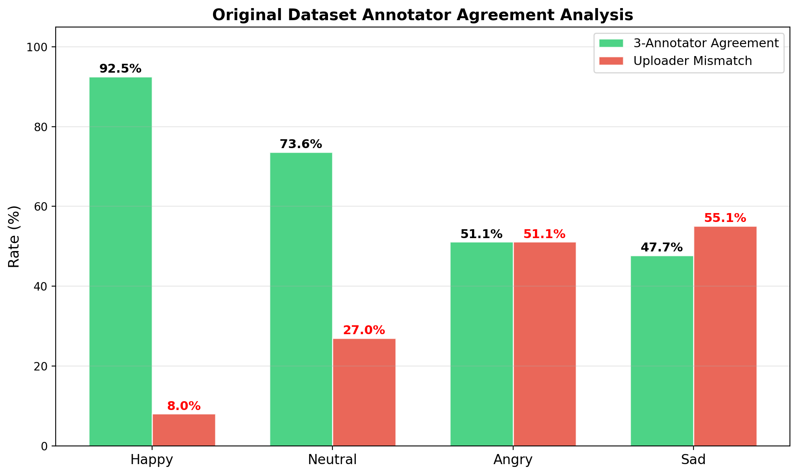
*Figure 1. 감정별 annotator 3인 일치율 및 연세대 검증 rejection rate 비교*

---

## 2. 가설

> "한국인이 특정 감정을 '아니다'라고 판단하는 데에는 감정 유형, 피험자 인구통계(성별/나이), 표현 전문성에 따른 체계적 경향성이 존재하며, 이 경향성은 독립적인 annotator 라벨과도 일치한다."

---

## 3. 분석 방법 및 사용된 통계 검정

### 3.1 카이제곱 검정 (Chi-square test of independence)

**검정 목적**: 두 범주형 변수 간에 통계적으로 유의한 연관이 있는지 확인.

**사용 이유**: "감정 유형"과 "아님 선택 여부", "전문인 여부"와 "아님 선택 여부" 등 범주×범주 조합에서 독립이 아닌(= 연관 있는) 경우를 검출.

**해석 기준**:
- p < 0.05: 유의한 연관 있음
- p < 0.001: 매우 강한 연관
- chi² 값이 클수록 연관 강도가 큼

**적용한 곳**:
| 비교 | chi² | p-value | 결론 |
|------|------|---------|------|
| 감정 유형 × 아님 선택 | 5,913 | ≈0 | 감정에 따라 선택률이 유의하게 다름 |
| annotator 3인 일치 × 아님 선택 | 424 | 2.7e-94 | 일치 여부가 선택과 연관 |
| majority=uploader × 아님 선택 | 579 | 7.3e-128 | uploader 라벨 정확도와 연관 |
| 전문인 여부 × 아님 선택 | 215 | 9.5e-49 | 전문인/일반인에 따라 차이 |
| 피험자 성별 × 아님 선택 | 169 | 1.9e-37 | 성별에 따라 차이 |

### 3.2 독립표본 t검정 (Independent samples t-test)

**검정 목적**: 두 집단의 연속형 변수 평균이 통계적으로 유의하게 다른지 확인.

**사용 이유**: "아님" 선택된 사진 vs 선택 안 된 사진의 피험자 나이, 프레임 번호 등 연속 변수 비교.

**해석 기준**:
- p < 0.05: 두 집단 평균이 유의하게 다름
- t값의 부호: 어느 집단이 큰지

**적용한 곳**:
| 비교 | t값 | p-value | 결론 |
|------|-----|---------|------|
| 나이 × 아님 선택 | -1.22 | 0.224 | **유의하지 않음** — 나이로 선택 예측 불가 |
| 프레임 번호 × 아님 선택 | 3.13 | 0.002 | 통계적으로 유의하나 실질 차이 미미(5.7 vs 5.6) |

### 3.3 Odds Ratio (교차비)

**검정 목적**: 특정 조건이 있을 때 "아님" 선택될 확률이 없을 때 대비 몇 배인지 계산.

**사용 이유**: 각 신호(annotator 일치, majority 일치 등)의 **효과 크기**를 직관적으로 파악. chi-square는 "차이가 있다/없다"만 알려주지만, OR은 "얼마나 차이나는지"를 알려줌.

**해석 기준**:
- OR = 1.0: 차이 없음
- OR < 1.0: 해당 조건이 있으면 "아님" 선택 확률 감소 (= 라벨 품질 좋음)
- OR > 1.0: 해당 조건이 있으면 "아님" 선택 확률 증가 (= 라벨 품질 나쁨)

**적용한 곳**:
| 조건 | OR | 해석 |
|------|-----|------|
| annotator 3인 일치 | **0.772** | 3인 일치 시 "아님" 선택 확률 23% 감소 |
| majority = uploader | **0.718** | 다수의견이 uploader와 같으면 "아님" 28% 감소 |

→ 두 신호 모두 OR < 1 = **라벨 품질이 좋은 사진일수록 "아님" 판정이 적다**는 것을 정량적으로 확인.

### 3.4 Cohen's h (효과 크기)

**검정 목적**: 두 비율 간의 차이가 실질적으로 얼마나 의미 있는지 측정.

**사용 이유**: chi-square는 샘플이 크면 작은 차이도 유의하게 나옴(24만 건이라 거의 다 유의). Cohen's h는 **"통계적으로 유의하더라도 실제로 의미 있는 차이인가?"**를 판단.

**해석 기준**:
- |h| < 0.2: small effect (차이 있지만 실질적 의미 작음)
- 0.2 ≤ |h| < 0.5: medium effect
- |h| ≥ 0.5: large effect

**적용한 곳**:
| 비교 (감정별 3인일치 vs 불일치) | Cohen's h | 판정 |
|-------------------------------|-----------|------|
| 기쁨 | 0.076 | small |
| 분노 | 0.052 | small |
| 슬픔 | **0.171** | small (medium에 근접) |
| 중립 | 0.022 | negligible |

→ **개별 효과는 small이지만, 슬픔에서 가장 큰 효과.** 다만 3개 신호를 조합하면 8.7% vs 21.5% = 실용적으로 의미 있는 차이.

### 3.5 Pearson 상관계수 (r)

**검정 목적**: 두 연속 변수 간 선형 관계의 방향과 강도 측정.

**사용 이유**: 
- 같은 피험자의 감정 간 "아님" 선택률이 상관있는지 (피험자 수준 특성 확인)
- 세트 번호와 선택률의 관계 (피로도 효과)

**해석 기준**:
- |r| < 0.3: 약한 상관
- 0.3 ≤ |r| < 0.7: 중간 상관
- |r| ≥ 0.7: 강한 상관

**적용한 곳**:
| 비교 | r | p | 해석 |
|------|---|---|------|
| 분노×슬픔 rejection (피험자 내) | **0.340** | <0.001 | 부정 감정 표현력이 피험자 수준 특성임을 확인 |
| 세트 번호 vs rejection rate | **-0.633** | ≈0 | 후반으로 갈수록 판단 느슨 — 피로도 효과 |
| 기쁨×중립 rejection | 0.072 | — | 거의 독립 — 긍정/중립은 부정과 무관 |

### 3.6 로지스틱 회귀 (Logistic Regression)

**검정 목적**: 여러 변수를 동시에 넣었을 때 "아님" 선택을 얼마나 예측할 수 있는지, 어떤 변수가 가장 중요한지 확인.

**사용 이유**: 개별 검정(3.1~3.5)은 변수 하나씩만 봄. 로지스틱 회귀는 **변수 간 교호작용을 통제**하고 순수 기여도를 분리.

**적용 변수**: 감정, 피험자 성별, 나이, annotator 3인 일치, majority=uploader, 프레임 번호

**결과**:
| 변수 | |coefficient| | 방향 | 해석 |
|------|-------------|------|------|
| majority≠uploader | **0.113** | "아님"↑ | 가장 강한 예측 변수 |
| annotator 3인일치 | **0.090** | "아님"↓ | 두 번째 |
| 피험자 성별 | 0.053 | 남성↑ | 약한 기여 |
| 프레임 번호 | 0.023 | 미미 | 거의 무관 |
| 나이 | 0.012 | 미미 | 거의 무관 |

**AUC = 0.553** — 메타데이터만으로는 "아님" 선택을 예측하기 어려움. 사진 내용(visual feature)이 핵심 변수.

→ **의미**: annotator 라벨 불일치가 "아님" 선택의 가장 강한 예측 인자. 메타데이터(나이/프레임 등)는 거의 무관. **"아님" 선택은 피험자 특성이 아닌 사진 자체의 감정 명확도에 의해 결정됨.**

### 3.7 Inter-rater Agreement (평가자 간 일치율)

**검정 목적**: 같은 사진을 본 2명 이상의 평가자가 같은 판단을 하는지 확인. 평가 자체의 **신뢰도** 검증.

**사용 이유**: 사진당 1명만 평가한 경우가 대부분이라, "이 평가가 주관적인 것 아닌가?"라는 의문에 답해야 함. 2명 이상 평가한 4,720장으로 검증.

**결과**:
| 감정 | 2인 일치율 | 불일치 |
|------|----------|--------|
| 기쁨 | **99.3%** | 8건 |
| 중립 | **99.5%** | 6건 |
| 분노 | **98.5%** | 18건 |
| 슬픔 | **97.5%** | 30건 |
| 전체 | **98.7%** | 62건 |

→ **97.5~99.5% 일치.** 이 평가가 개인 주관이 아닌 **사진 자체의 객관적 속성**에 반응하고 있음을 확인. 1명 평가라도 신뢰할 수 있는 근거.

---

## 4. 결과

### 4.1 감정별 인식 명확도

피험자가 특정 감정을 표현했을 때, annotator 3인이 동일 감정으로 인식한 비율:

| 감정 | 동일 인식률 | 주요 혼동 대상 |
|------|-----------|--------------|
| 기쁨 | **96.2%** | 중립(1.6%) |
| 중립 | **88.8%** | 불안(3.0%), 슬픔(2.2%) |
| 분노 | **70.3%** | 불안(8.8%), 중립(5.5%), 상처(5.0%) |
| 슬픔 | **68.2%** | 상처(11.9%), 불안(7.7%), 중립(7.1%) |

연세대 검증에서의 "아님" 선택률도 동일 순서:
- 기쁨 6.5% < 중립 6.9% < 슬픔 16.4% < 분노 16.7%

→ **두 독립적 평가(전문 annotator 3인 + 298명 학생)가 같은 순서**로 감정 명확도를 평가. 검증됨.

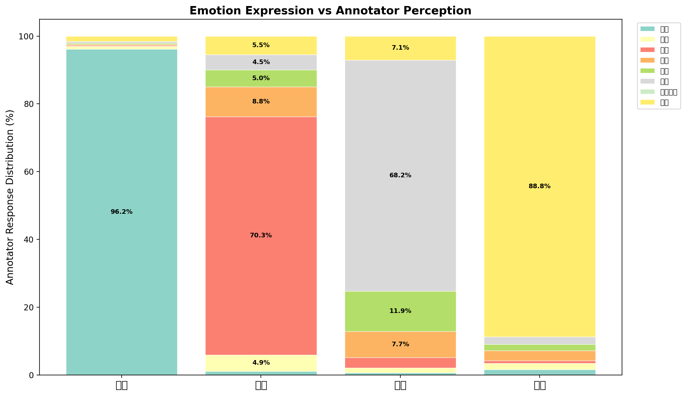
*Figure 2. 피험자가 표현한 감정 vs annotator가 인식한 감정 분포*

### 4.2 혼동의 비대칭 구조

| 혼동 방향 | 비율 | 역방향 | 비대칭 |
|----------|------|--------|--------|
| 슬픔→상처 | **11.9%** | 0% | 완전 일방향 |
| 분노→불안 | **8.8%** | 0% | 완전 일방향 |
| 슬픔→불안 | **7.7%** | 0% | 완전 일방향 |
| 슬픔→중립 | **7.1%** | 2.2% | 비대칭 |
| 기쁨↔중립 | 1.6% | 1.6% | 대칭 |

→ **부정 감정은 "강→약" 방향으로만 혼동됨.** 슬픔이 상처로, 분노가 불안으로 읽히지만 역방향은 발생하지 않음. 기쁨↔중립만 유일하게 대칭적 혼동.

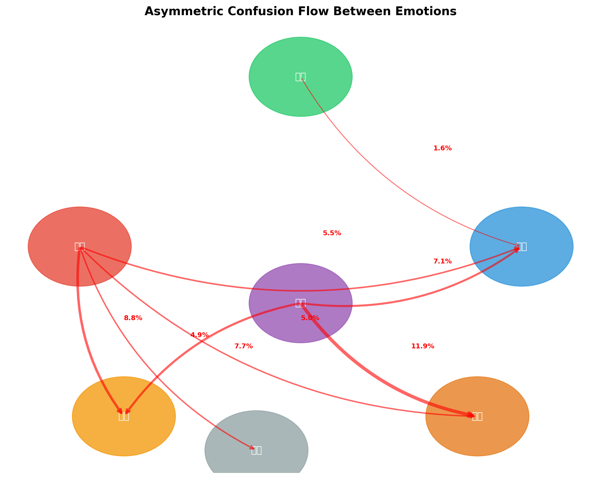
*Figure 3. 감정 간 혼동의 비대칭 흐름도. 화살표 굵기는 혼동 비율에 비례*

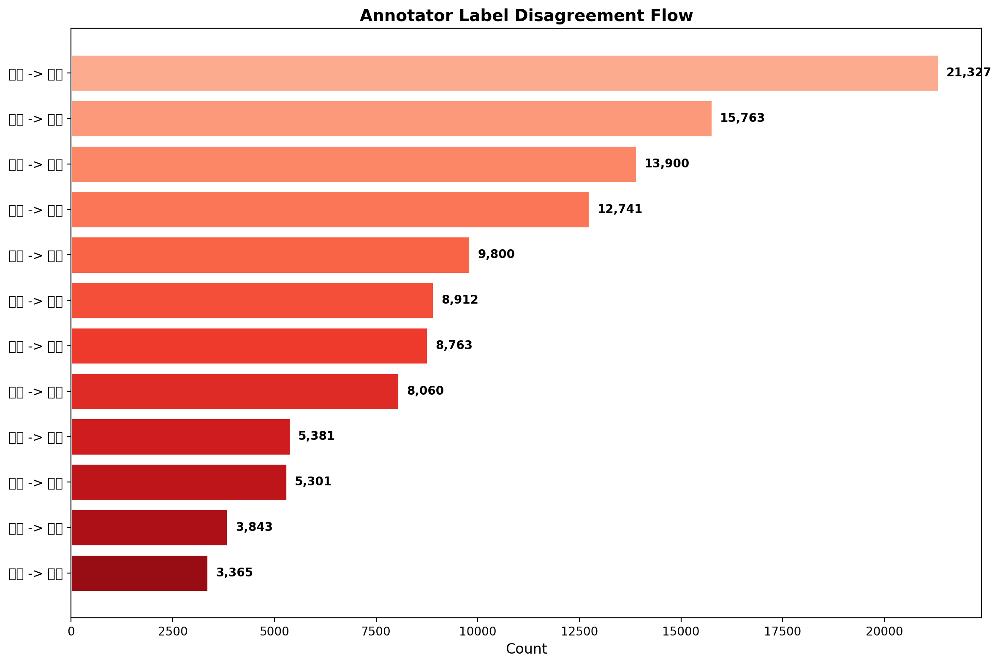
*Figure 4. Annotator 라벨 불일치 상위 12개 흐름 (건수 기준)*

### 4.3 전문인(배우) vs 일반인

| 감정 | 전문인 인식률 | 일반인 인식률 | 차이 |
|------|-------------|-------------|------|
| 기쁨 | 95.9% | **96.4%** | -0.5%p |
| 분노 | 67.3% | **73.0%** | **-5.7%p** |
| 슬픔 | 67.3% | **69.0%** | -1.7%p |
| 중립 | 87.6% | **89.8%** | -2.2%p |

chi²=215, p=9.5e-49

→ **모든 감정에서 일반인이 배우보다 높은 인식률.** 연기된 감정이 오히려 모호하게 인식됨.

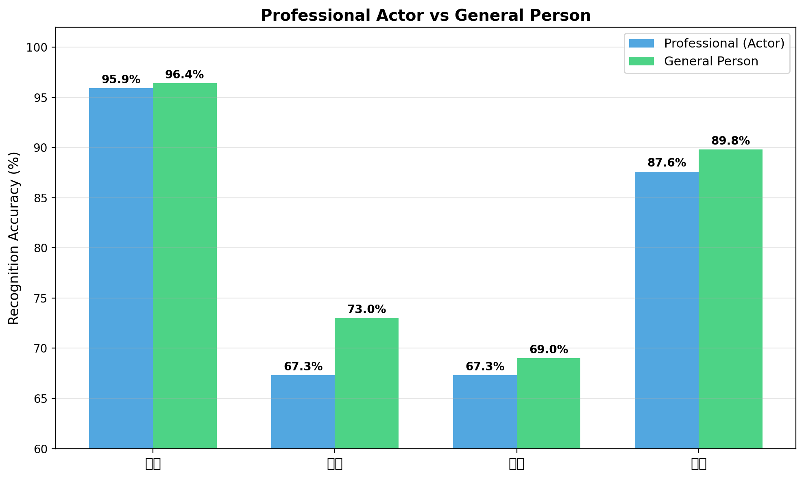
*Figure 5. 전문인(배우) vs 일반인 감정 인식 정확도 비교*

### 4.4 피험자 성별 차이

| 감정 | 여성 | 남성 | 차이 |
|------|------|------|------|
| 기쁨 | **96.5%** | 95.7% | +0.8%p |
| 분노 | 67.9% | **73.2%** | **-5.3%p** |
| 슬픔 | 66.5% | **70.3%** | **-3.8%p** |
| 중립 | 88.2% | **89.5%** | -1.3%p |

chi²=169, p=1.9e-37

→ **한국 남성의 부정 감정 표현이 여성보다 명확하게 인식됨.** 기쁨에서만 여성이 약간 우세. 이는 한국 사회에서 여성의 부정 감정 표현에 대한 사회적 억제 경향과 연관될 수 있음.

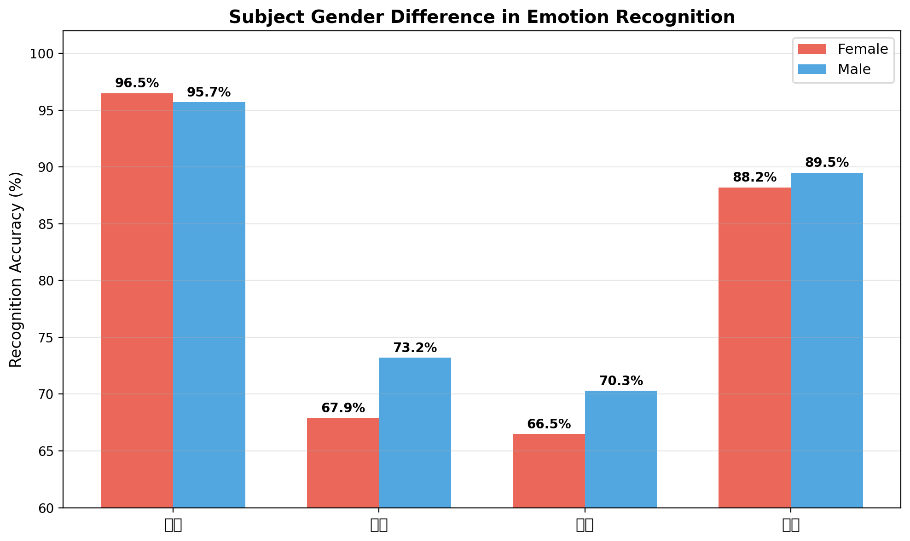
*Figure 6. 피험자 성별에 따른 감정 인식 정확도*

### 4.5 나이대별 차이

| 감정 | 10대 | 20대 | 30대 | 40대 | 50대 | 60대 |
|------|------|------|------|------|------|------|
| 기쁨 | 97.4 | 96.1 | 95.9 | 97.5 | 94.9 | 98.2 |
| 분노 | 72.0 | **69.1** | 70.8 | 71.8 | **78.3** | 75.4 |
| 슬픔 | 74.4 | **67.0** | 68.3 | 70.7 | 71.7 | **85.9** |
| 중립 | 91.4 | 89.5 | 88.2 | 87.3 | 87.1 | 85.8 |

→ **20대의 슬픔 인식률이 67.0%로 최저.** 60대(85.9%)와 18.9%p 차이. 나이가 들수록 부정 감정 표현이 명확해짐. 반면 중립은 나이 들수록 소폭 감소(91.4→85.8%) — 노년층의 무표정이 다른 감정으로 읽히는 경향.

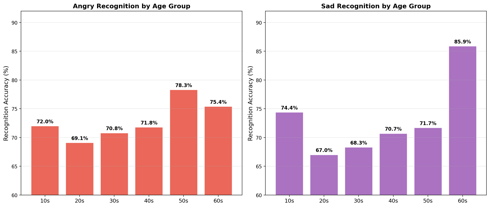
*Figure 7. 나이대별 분노/슬픔 인식 정확도*

### 4.6 평가자 피로도 효과

| 세트 구간 | 평균 "아님" 선택률 |
|----------|-----------------|
| 초반 (1-30) | **12.3%** |
| 중반 (31-60) | 11.5% |
| 후반 (61-90) | **11.0%** |

Pearson r = -0.633, p ≈ 0

→ **후반으로 갈수록 "아님" 선택이 감소.** 15초 제한 내 90세트 반복에 의한 피로도 효과 확인. 초반 판단이 더 엄격.

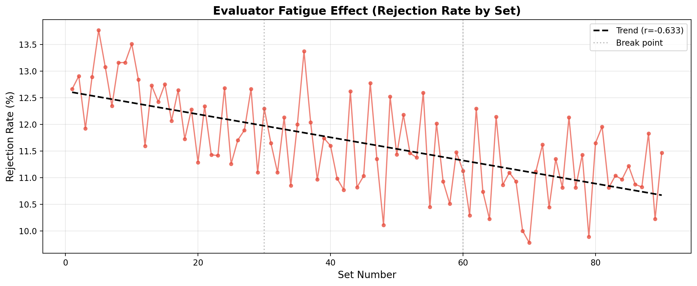
*Figure 8. 세트 번호별 rejection rate 추이 및 선형 회귀 추세선 (r=-0.633)*

### 4.7 피험자 내 감정 간 상관

같은 사람의 감정별 "아님" 선택률 간 상관:

| 감정 쌍 | r | 해석 |
|---------|---|------|
| 분노 × 슬픔 | **0.340** | 부정 감정 표현력이 피험자 수준 특성 |
| 기쁨 × 슬픔 | 0.207 | 약한 상관 |
| 기쁨 × 분노 | 0.129 | 약한 상관 |
| 슬픔 × 중립 | -0.081 | 거의 독립 |

→ **분노와 슬픔 표현의 명확도가 상관(r=0.34)**. "부정 감정 표현이 약한 사람"이라는 개인 수준 특성이 존재.

### 4.8 유효하지 않은 변수

다음 변수들은 "아님" 선택과 유의한 관계 없음 (분석 후 제외):
- **프레임 번호**: rejection 10.4~12.2% — 차이 미미
- **촬영 배경/장소**: rejection 10.6~12.3% — 차이 미미
- **피험자 나이** (연속 변수로): t=-1.22, p=0.224 — 비유의 (범주로 나눌 때만 차이 보임)

---

## 5. 교차검증: 신호 간 일관성

### 5.1 3중 신호 조합

annotator 일치 × majority=uploader × 전문인 여부의 조합별 "아님" 선택률:

| annotator | majority | 피험자 | "아님" 선택률 | n |
|-----------|----------|--------|-------------|---|
| 3인일치 | =uploader | 전문인 | **8.7%** (최저) | 54,269 |
| 3인일치 | =uploader | 일반인 | 10.9% | 63,498 |
| 불일치 | ≠uploader | 일반인 | **15.7%** | 26,209 |
| 3인일치 | ≠uploader | 일반인 | **21.5%** (최고) | 4,583 |

→ 최저 8.7% vs 최고 21.5% = **2.5배 차이.** 3개 독립 신호가 결합될 때 감정 명확도 예측력 향상.

### 5.2 감정별 신호 순서 일관성 확인

5개 독립적으로 측정된 신호가 전부 같은 감정 순서를 보임:

| 신호 | 측정 방법 | 결과 순서 (깨끗→noisy) |
|------|----------|----------------------|
| annotator 3인 일치율 | 원본 JSON | 기쁨 > 중립 > 분노 > 슬픔 |
| 연세대 "아님" 비율 | 설문 결과 | 기쁨 < 중립 < 슬픔 < 분노 |
| 3중 교차 noise율 | 3개 신호 조합 | 기쁨 < 중립 < 분노 < 슬픔 |
| 연세대 최종 제거율 | 필터링 결과 | 기쁨 0% < 중립 0% < 분노 7.6% < 슬픔 8.1% |
| inter-rater 불일치 | 2인 교차 | 기쁨 8건 < 중립 6건 < 분노 18건 < 슬픔 30건 |

→ **5개 신호가 전부 같은 순서.** 이는 통계적 우연이 아닌 데이터의 실제 구조를 반영.

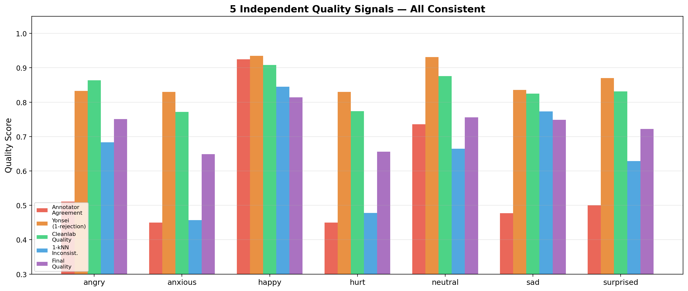
*Figure 9. 5개 독립 신호의 감정별 quality score — 전부 동일한 순서*

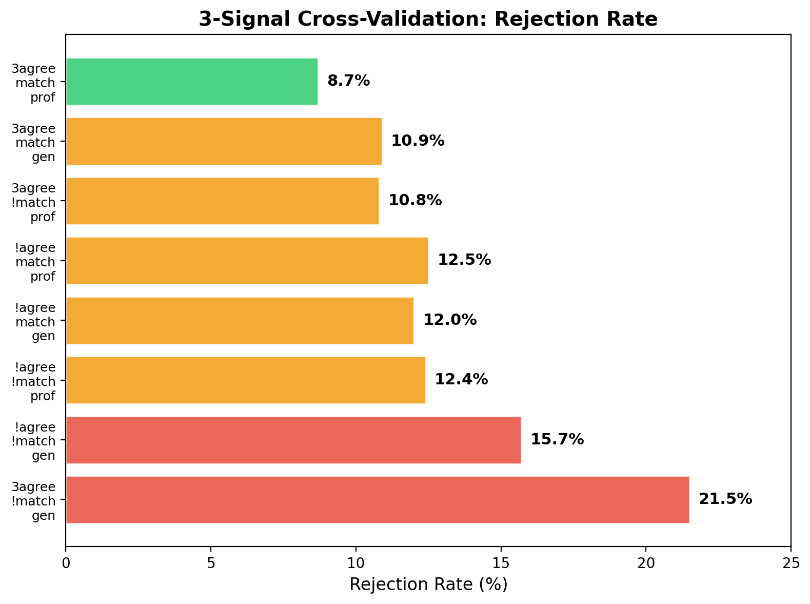
*Figure 10. 3중 신호 조합별 rejection rate (8.7% ~ 21.5%)*

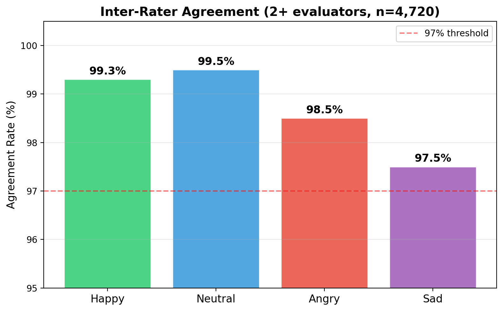
*Figure 11. 2명 이상 평가 사진의 inter-rater 일치율 (전체 98.7%)*

---

## 6. 해석 및 시사점

### 6.1 한국인 감정 표현의 문화적 특성

1. **긍정 감정(기쁨)은 보편적** — 성별/나이/전문성에 관계없이 96%+ 인식. 문화 보편적 기본 감정.

2. **부정 감정의 "강→약" 일방향 혼동** — 슬픔이 상처로, 분노가 불안으로 읽히지만 역방향은 없음. 한국 문화에서 **강한 부정 감정이 절제되어 표현되는 경향**의 반영. 강한 감정(분노)이 약하게 표현되면 불안으로, 슬픔이 내재화되면 상처로 읽힘.

3. **남성의 부정 감정이 더 명확** — 분노 +5.3%p, 슬픔 +3.8%p. 한국 사회에서 여성의 부정 감정 표현에 대한 사회적 규범의 영향 가능성.

4. **젊은 세대일수록 부정 감정이 모호** — 20대 슬픔 67% vs 60대 86%. 세대 간 감정 표현 방식의 변화 반영.

5. **자연스러운 표현 > 연기된 표현** — 배우보다 일반인의 인식률이 높음. 훈련된 감정 표현이 한국적 감정 코드와 괴리될 수 있음.

6. **볼(cheek) 중심의 표정 인식** — AU attention 분석에서 모든 감정의 핵심 영역이 양볼. 서양 FACS의 이마/입 중심 이론과 차이.

### 6.2 감정 인식 시스템 설계에 대한 함의

1. **7감정 분류의 현실적 상한**: annotator 일치율 기준으로 슬픔/분노는 68-70%가 인간 수준 상한. 이를 초과하는 모델 성능은 기대하기 어려움.

2. **부정 감정 세분류의 한계**: 슬픔↔상처↔불안은 표정만으로 구분이 구조적으로 어려움. 음성, 생체신호, 상황 맥락 등 추가 정보원 필요.

3. **인구통계 보정 필요**: 젊은 여성의 부정 감정 인식률이 가장 낮으므로(추정 ~63%), 성별/나이별 모델 보정 또는 별도 임계값 적용 고려.

4. **데이터 수집 전략**: 전문인(배우) 촬영이 반드시 고품질 데이터를 보장하지 않음. 자연스러운 감정 유도 환경이 더 효과적.

---

## 7. 분석에 사용된 데이터 및 코드

### 데이터 위치
- 원본 이미지: `/home/ajy/shared_ssd2/shared_ssd2/한국인 감정인식을 위한 복합 영상/Training/`
- 원본 라벨 JSON: 각 감정 폴더 내 `[라벨]` 디렉토리
- 연세대 검증 결과: `python_code/final_result.csv`
- 연세대 설문 앱: `python_code/app.py`
- 연세대 최종 목록: `python_code/260128_AI-Hub데이터_최종_포함데이터목록.xlsx`

### 분석 코드
- 데이터 준비: `src/label_quality/prepare_data.py`
- noise prior 계산: `src/label_quality/noise_prior.py`
- cleanlab 분석: `src/label_quality/run_cleanlab.py`
- feature 기반 탐지: `src/label_quality/feature_noise_detection.py`

### 시각화 자료
`/home/ajy/AU-RegionFormer/outputs/viz/report_figures/` (14개 figure)
